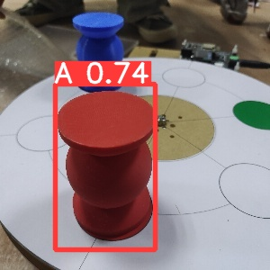
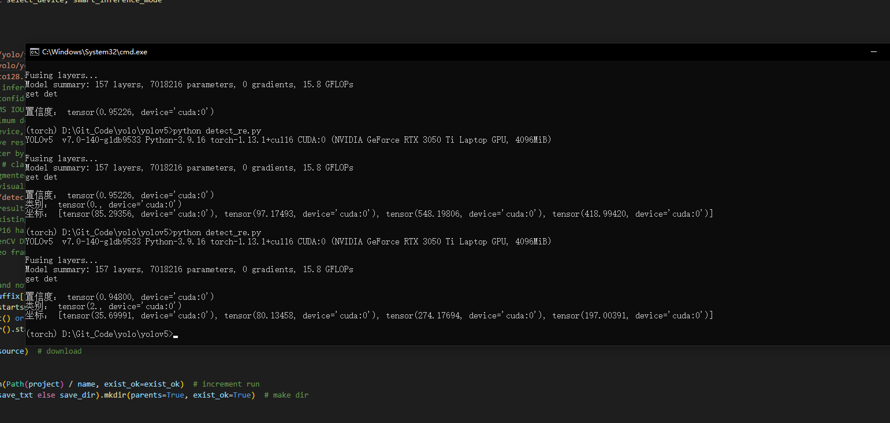
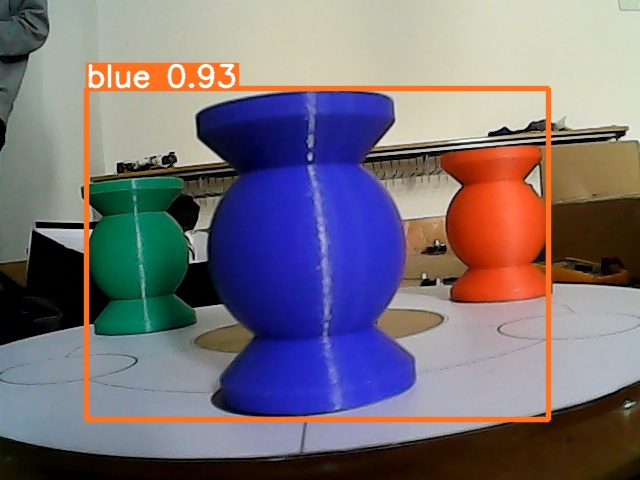

# Raspberry_Pi

## Introduction

树莓派（Raspberry Pi）是各种派中最早开始流行起来的一个嵌入式Linux板卡，其本质是尺寸仅有信用卡大小的一个小型电脑。你可以将树莓派连接电视、显示器、键盘鼠标等设备当一台正常Linux电脑使用，目前树莓派能替代日常桌面计算机的多种用途包括文字处理、电子表格、媒体中心甚至是游戏；也可以拿它来当作个人网站的服务器，构建自己的博客；甚至可以用树莓派的硬件资源做各种有趣的硬件项目，等等。 引自[树莓派（以及各种派）使用指南](https://zhuanlan.zhihu.com/p/77585297)

## Setting Envs

 - 安装系统 [Install Raspberry Pi OS using Raspberry Pi Imager](https://www.raspberrypi.com/software/)
 - 配置ssh
 - 安装opencv-python
 - 安装serial
  ```shell
  pip install opencv-python
  pip install pyserial
```

## Commands

```shell
ls /dev/tty* # 查看串口
sudo shutdown -h now # 关机
sudo reboot # 重启
```

## Disadvantages

- 开机时间太长，达16~20s
- 算力不足以推理模型

## Solutions

- 使用kernel自己编译64位系统或使用SSD作为boot盘 关闭不必要的服务 预计最多可缩短开机时间至5s
- 插入Intel神经计算棒


## Camera

使用USB摄像头，分辨率为640x480，帧率为30fps

## QR_Code Scan
使用OpenCV进行二维码扫描，精度和速度均较高

## Path Planning
使用A*算法进行路径规划，要求电机精度达标

## RGB Scan
使用yolov5对三色物料进行识别

输入：img

输出：置信度、坐标、类别

可视化效果如下






## Communicatiy with Arduino

使用串口通信，波特率为9600

注意! 使用usb线缆会让Arduino重新启动

应使用GPIO中的RX TX进行通信

其他通信方法
- I2C
- esp8266 局域网通信(最佳)

